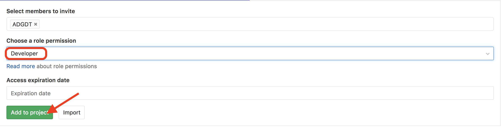

For the next step, get into pairs.  One person will be the "Owner" and the other
will be the "Collaborator". The goal is that the Collaborator add changes into
the Owner's repository. We will switch roles at the end, so both persons will
play Owner and Collaborator.

> ## Practicing By Yourself
>
> If you're working through this lesson on your own, you can carry on by opening
> a second terminal window.
> This window will represent your partner, working on another computer. You
> won't need to give anyone access on GitLab, because both 'partners' are you.
{: .callout}

The Owner needs to give the Collaborator access.
On GitLab,this is done by adding members to your project. Click the gear icon on the left,
then select Members:


Click on the textfield "Select members to invite" and pick your Collaborator:


> ## GitLab Roles
> GitLab counts with a complex system of user/role permissions. For all actions in this lesson `Developer`
> role is well enougth, as well as for the requierements for a real-world scientific collaborator. 
> If you need a different permission level for your collaborators have a look to the [GitLab documentation](https://docs.gitlab.com/ee/user/permissions.html).
>
{: .callout}

Add `Developer` role to your Collaborator and finish the proccess by clicking `Add to project`:



The member list of the project should look this way:


To accept access to the Owner's repo, the Collaborator
needs to go to [https://github.com/notifications](https://github.com/notifications).
Once there she can accept access to the Owner's repo.

Next, the Collaborator needs to download a copy of the Owner's repository to her
 machine. This is called "cloning a repo". To clone the Owner's repo into
her `home` folder, the Collaborator enters:

~~~
$ cd ~
$ git clone https://gitlab.ift.uam-csic.es/scwtest/planets_coll_scwtest.git
~~~
{: .bash}

Remember the Collaborator must replace `scwtest` with the Owner's username.


The Collaborator can now make a change in her clone of the Owner's repository,
exactly the same way as we've been doing before:

~~~
$ cd ~/planets_coll_scwtest
$ nano pluto.txt
$ cat pluto.txt
~~~
{: .bash}

~~~
It is so a planet!
~~~
{: .output}

~~~
$ git add pluto.txt
$ git commit -m "Add notes about Pluto"
~~~
{: .bash}

~~~
 1 file changed, 1 insertion(+)
 create mode 100644 pluto.txt
~~~
{: .output}

Then push the change to the *Owner's repository* on GitLab:

~~~
$ git push origin master
~~~
{: .bash}

~~~
Counting objects: 4, done.
Delta compression using up to 4 threads.
Compressing objects: 100% (2/2), done.
Writing objects: 100% (3/3), 306 bytes, done.
Total 3 (delta 0), reused 0 (delta 0)
To https://github.com/vlad/planets.git
   9272da5..29aba7c  master -> master
~~~
{: .output}

Note that we didn't have to create a remote called `origin`: Git uses this
name by default when we clone a repository.  (This is why `origin` was a
sensible choice earlier when we were setting up remotes by hand.)

Take a look to the Owner's repository on its GitLab website now (maybe you need
to refresh your browser.) You should be able to see the new commit made by the
Collaborator.

To download the Collaborator's changes from GitLab, the Owner now enters in her local `planets` folder:

~~~
$ git pull origin master
~~~
{: .bash}

~~~
remote: Counting objects: 4, done.
remote: Compressing objects: 100% (2/2), done.
remote: Total 3 (delta 0), reused 3 (delta 0)
Unpacking objects: 100% (3/3), done.
From https://github.com/vlad/planets
 * branch            master     -> FETCH_HEAD
Updating 9272da5..29aba7c
Fast-forward
 pluto.txt | 1 +
 1 file changed, 1 insertion(+)
 create mode 100644 pluto.txt
~~~
{: .output}

Now the three repositories (Owner's local, Collaborator's local, and Owner's on
GitLab) are back in sync.

> ## A Basic Collaborative Workflow
>
> In practice, it is good to be sure that you have an updated version of the
> repository you are collaborating on, so you should `git pull` before making
> our changes. The basic collaborative workflow would be:
>
> * update your local repo with `git pull origin master`,
> * make your changes and stage them with `git add`,
> * commit your changes with `git commit -m`, and
> * upload the changes to GitLab with `git push origin master`
>
> It is better to make many commits with smaller changes rather than
> of one commit with massive changes: small commits are easier to
> read and review.
{: .callout}

> ## Switch Roles and Repeat
>
> Switch roles and repeat the whole process.
{: .challenge}

> ## Review Changes
>
> The Owner push commits to the repository without giving any information
> to the Collaborator. How can the Collaborator find out what has changed with
> command line?
>
> > ## Solution
> > On the command line, the Collaborator can use ```git fetch origin master```
> > to get the remote changes into the local repository, but without merging
> > them. Then by running ```git diff master origin/master``` the Collaborator
> > will see the changes output in the terminal.
> >
> {: .solution}
{: .challenge}

> ## Comment Changes in GitLab
>
> The Collaborator has some questions about one line change made by the Owner and
> has some suggestions to propose.
>
> With GitLab, it is possible to comment the diff of a commit. On the `Commit` tab, select
> the desired commit and you will find a textbox for comments just below the diff.
>
> The Collaborator posts its comments and suggestions using GitLab interface, and they are notified to Owner by email.
{: .challenge}

> ## Version History, Backup, and Version Control
>
> Some backup software can keep a history of the versions of your files. They also
> allows you to recover specific versions. How is this functionality different from version control?
> What are some of the benifits of using version control, Git and GitLab?
{: .challenge}
